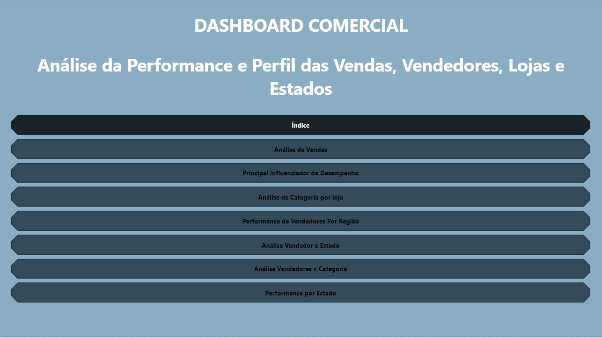
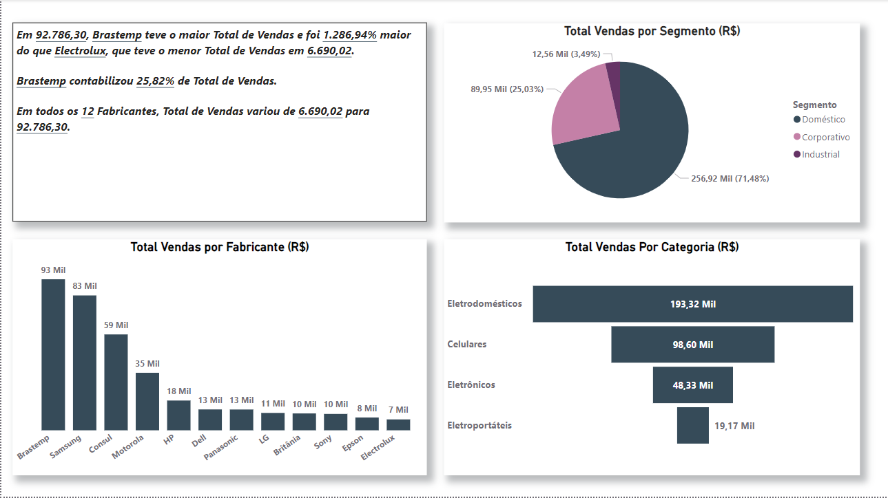
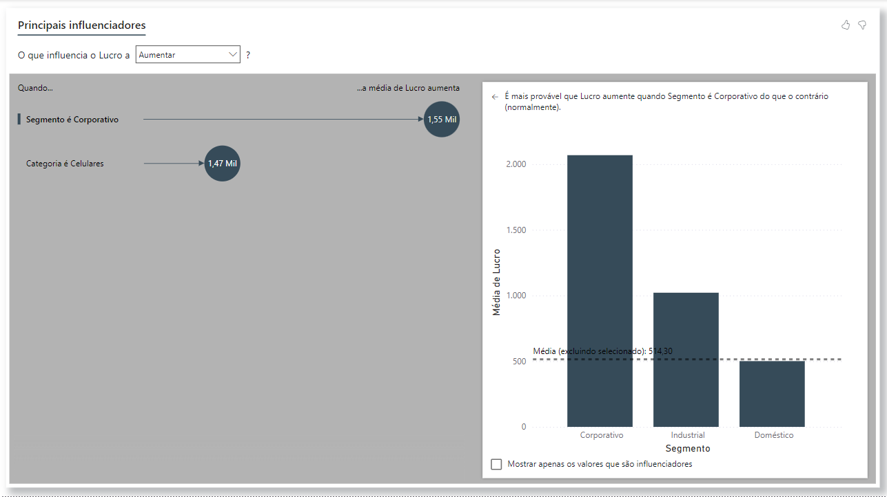
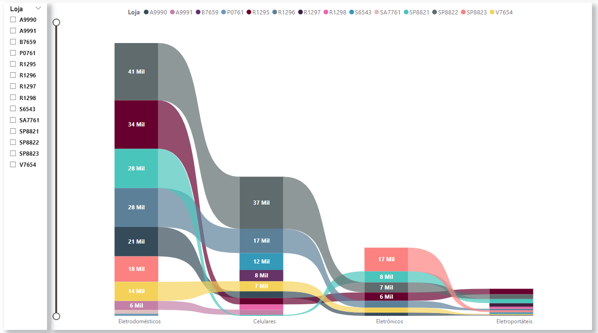
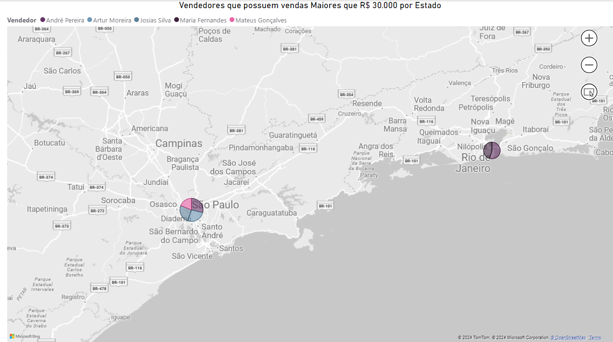
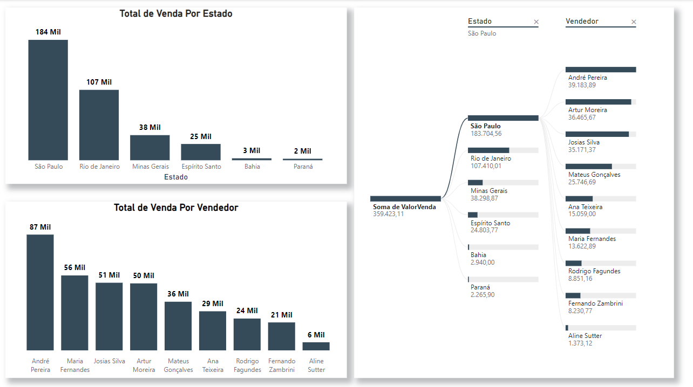
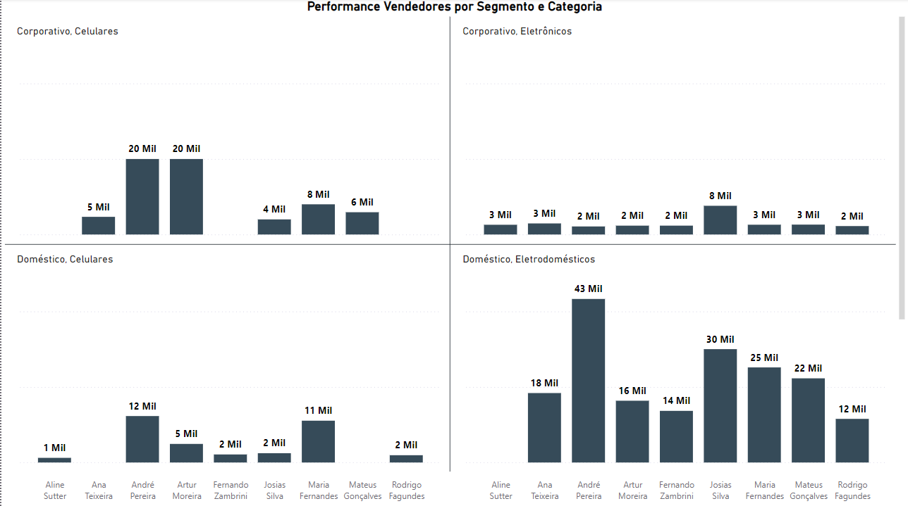
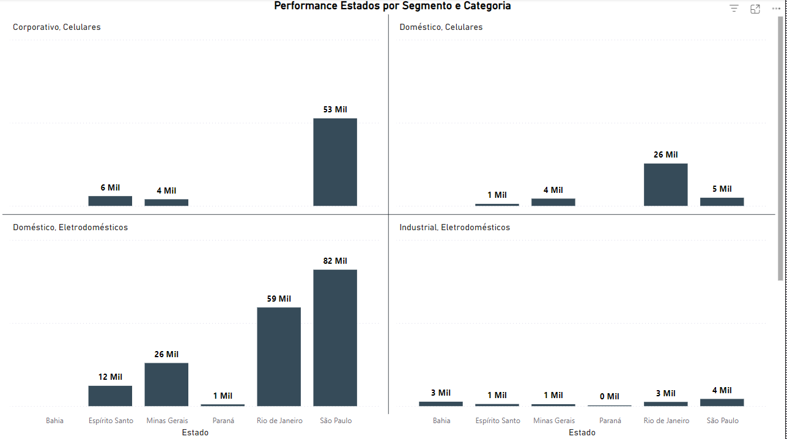

# Análise de Dados com Power BI - Setor de Marketing 

* Em anexo está a base de dados e o arquivo de contendo a análise

* Respostas e Insights:

    1. Segmento de maior vendas é o doméstico
        
        * Categoria que mais vende (consoante com o segmento) é eletrodoméstico
        
        * Os produtos que mais vendemos são do fabricante "Brastemp", uma renoamada marca em, principalmente, eletrodoméstico.
    
    2. Em relação ao segmento, o que mais influencia e tem a capacidade de aumentar nosso faturamento e lucro é o "Corporativo":
        
        * Isso se deve ao fator de que, a média de faturamentos e lucros por unidades vendidas desse segmento e categoria ("Corporativo" e "Celulares", respectivamente) são maiores que qualquer outra;
        
        * O segmento "Corporativo" (média de aproximadamente R$ 2.068,00 por venda) tem uma média de R$1.550,00 maior que o "Doméstico" que possui menor média de R$ 500,00
        
        * O segmento "Corporativo" possui uma média maior que o segundo colocado dos segmentos, que é o "Industrial" com uma média de aprximadamente R$ 1.021,00.

    3. Em relação a categoria, a que mais influencia e tem a capacidade de aumentar nosso faturamento e lucro é a categoria (consoante com o segmento) "Celulares".
        * Sobre a categoria "Celulares", ela possui uma média de aproximadamente R$ 1.973,00 de faturamento. 
        
        * Ela possuia uma média maior em R$ 1.200 que a segunda colocada, a categoria "Eletrodoméstico", com uma média de aproximadamente R$710,00
        
        * E uma média cerca de R$ 1.940,00 maior que a ultima colocada, a categoria de Eletroportateis, possuindo uma média de R$34,00.

    4. O nosso principal estado de atuação, no quesito faturamento, são São Paulo e Rio de Janeiro, respectivamente.

    5. Nossos principais vendedores são:
        1. André Pereira
        2. Maria Fernandes
        3. Josias Silva
        4. Arthur Moreira

    6. Quais deverá ser nossos próximos passos?
        * Manter nossas vendas atuais e focar nos itens nos traz mais faturamento e lucro
    
    7. Como atuar para que isso ocorra?
        * Primeiro: Pelas análises, chegamos a conclusão que o nosso principal influenciador de faturamento e lucro é o segmento "Corporativo" e a caterogira "Celulares", então devemos dar um enfoque a mais nesses produtos.

        * Segundo: Ainda pela análise, podemos ver que os vendedores "Aline Sutter", "Fernando Zambrini" e "Rodrigo Fagundes" possuem zero de vendas dos itens do segmento e categoria que mais pode influenciar no nosso faturamento e lucro. Poderiamos atuar elevando a porcentagem de bônus para esses vendedores para vendas desses itens.

        * Terceiro: Dar um enfoque nos estado "Bahia", "Paraná" e "Rio de Janeiro" para vender itens do segmento e categoria que tem maior potencial de faturamento e lucro. Nas análises, esses estados mostra baixa performance (chegando a zero) nesses itens.

