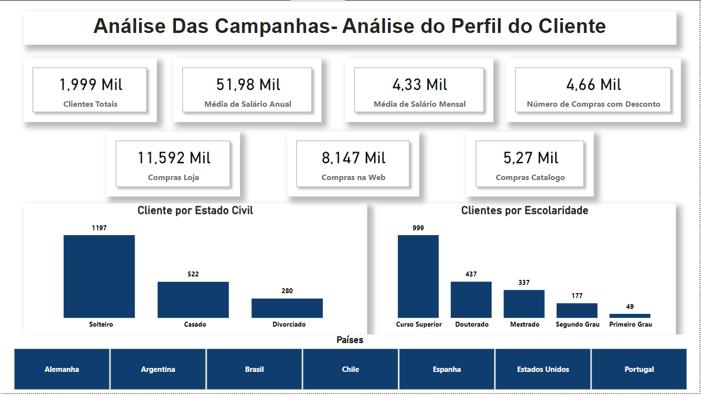
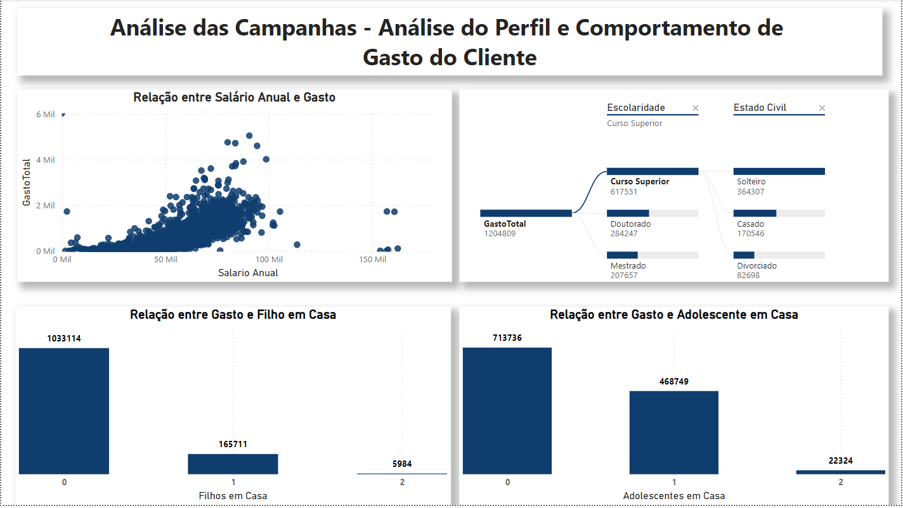
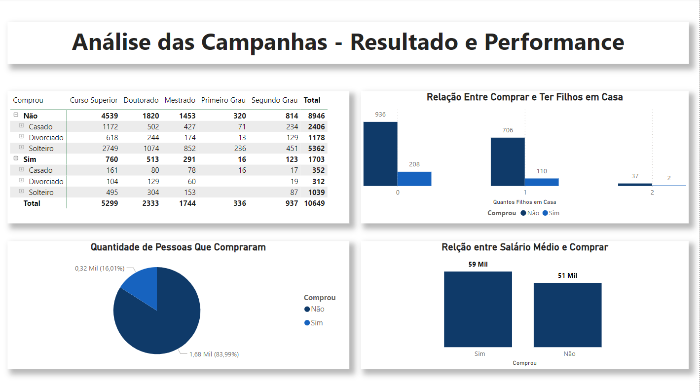

# Análise de Dados com Power BI - Setor de Marketing 

* Em anexo está a base de dados e o arquivo de contendo a análise

* Segue resultado das análises:

* Primeiramente, realizei uma análise do perfil do cliente que compraram de acordo com a campanha que fizemos:

* Segundamente, realizei uma análise relacionando o perfil do cliente e seu perfil de compra e gasto: 

* Terceiramente, realizei uma análise para ver qual foi a performance e resultado de conversão que essas campanhas tiveram e a relação do perfil do cliente x campanha x compra

* Finalizando a análise, relacionei países dos consumidores, o perfil de gasto desses países em relação aos anos

